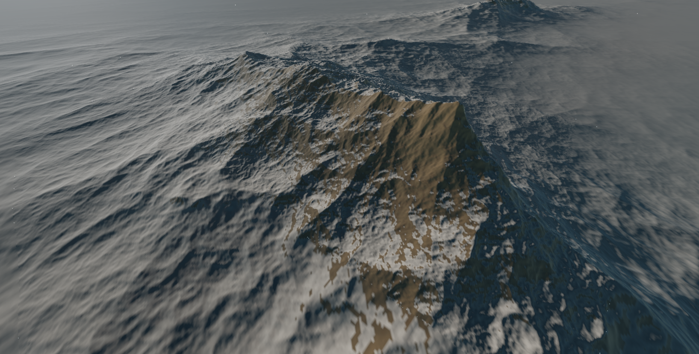
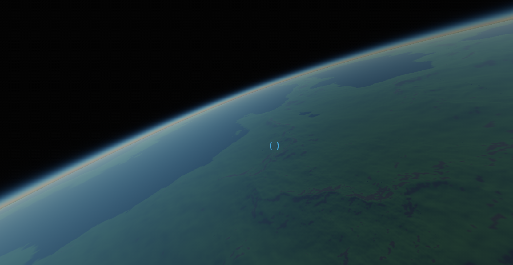
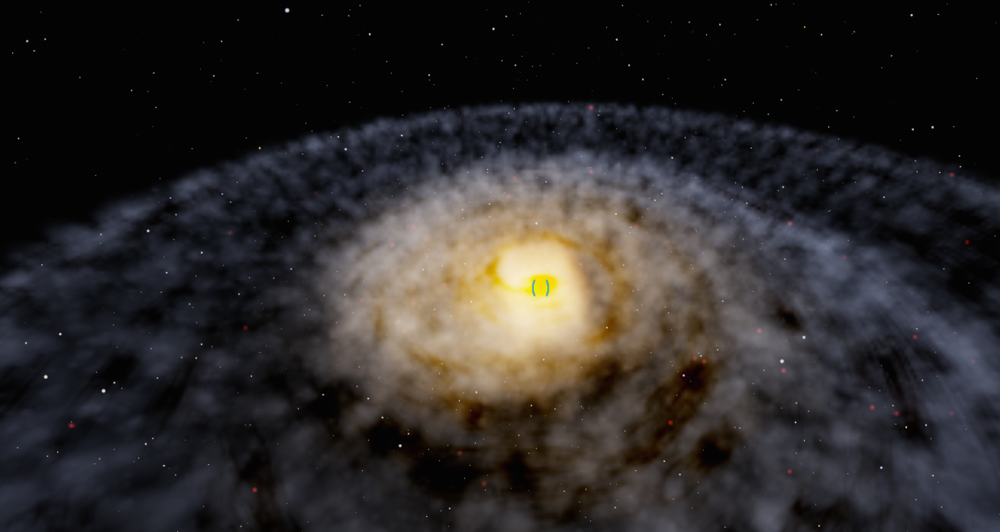

# TundraEngine

Tundra Engine is a game engine meant for very large coordinate scales, such as realistically sizes planets, with PBR tools and Bullet integration. Transforms are stored with double precision on the CPU, then transformation matrices are mapped to be camera-local prior to GPU upload to preserve fidelity. 

Here are some screenshots from the project this engine was created for:

